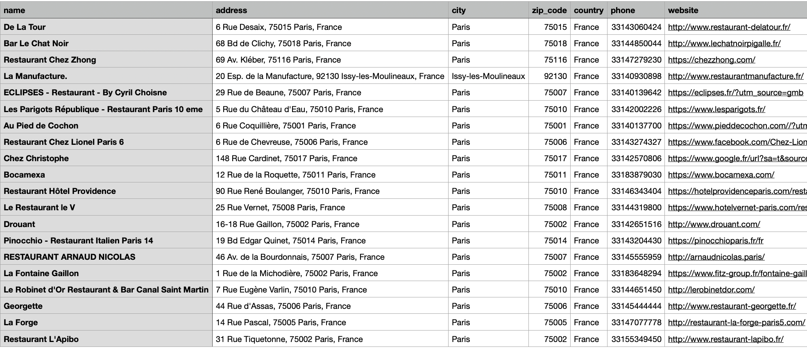
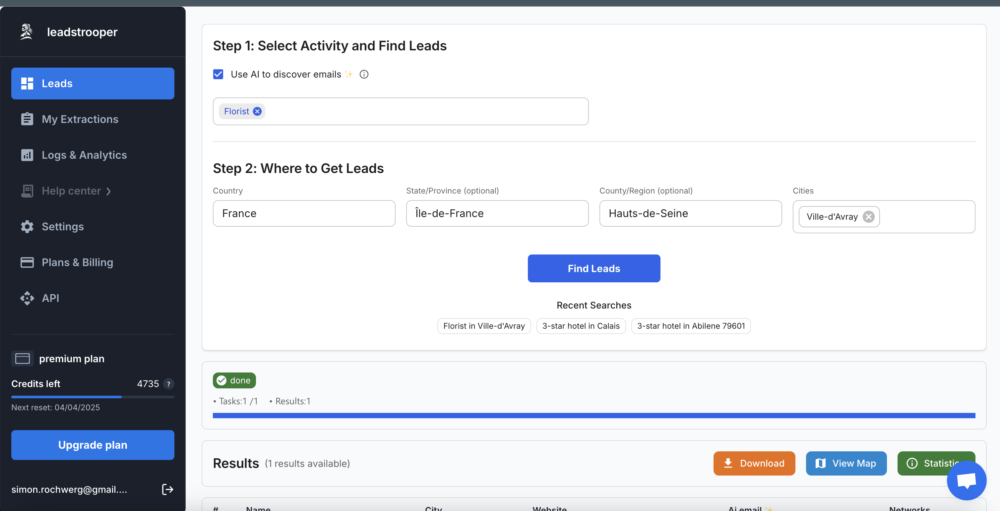

# Google Maps Scraper 🚀

A powerful and flexible Python tool for scraping business information from Google Maps. This scraper allows you to extract detailed information about businesses, including contact details, ratings, opening hours, and more.

## Features

- 🔍 **Search Flexibility**: Search for businesses using Google Maps URLs
- 🌐 **Language Support**: Configure searches in multiple languages (supports all Google Maps languages)
- 🌍 **Country Customization**: Set specific country for search results
- ⭐ **Rating Filters**: Filter results by rating (Any rating, 2.0+, 2.5+, 3.0+, 3.5+, 4.0+, 4.5+)
- 📊 **Detailed Information**: Extract comprehensive business details:
  - Basic info (name, address, category)
  - Contact details (phone, website)
  - Geographical data (coordinates)
  - Business status (opening hours, temporary/permanent closure)
  - Ratings and reviews count
- 📱 **Contact Collection**: Optionally extract email addresses and social media profiles from business websites
- 🖼️ **Image Collection**: Gather business images with metadata
- 📁 **CSV Export**: Save results to CSV with proper column headers and formatting
- 🔄 **Pagination Support**: Navigate through multiple pages of search results
- 📝 **Detailed Logging**: Comprehensive logging for monitoring and debugging

## Why this is the best Google Maps scraper?

- ✅ **Fully coded in Python**: Built entirely with Python, making it easy to understand, modify, and extend
- 🚀 **Powered by Python requests**: Uses the robust requests library for reliable HTTP communication
- 🔍 **Parses raw HTTP content**: Works directly with raw HTTP responses for maximum efficiency and reliability
- 📈 **Maintainable and scalable**: Well-structured code that can be deployed at scale for large data collection projects
- 💯 **Completely free**: Open-source and free to use, with no hidden costs or limitations
- 🌟 **Simply awesome**: Designed with usability and performance in mind, making it a joy to work with

## CSV Output Format

The CSV file will contain columns for all available properties, with proper headers:



Example of data included in the CSV:

```
name,address,city,zip_code,country,phone,additional_phone,email,website,facebook,instagram,category,score,ratings,opening_hours,is_temporarily_closed,is_permanently_closed,lat,lng,url,description,price
Le Jules Verne,"Avenue Gustave Eiffel, 75007 Paris, France",Paris,75007,France,+33 1 83 77 34 34,,,"https://www.restaurants-toureiffel.com/en/jules-verne-restaurant.html",,,Restaurant,4.3,3542,"Monday: 12–1:30 PM, 7–9 PM
Tuesday: 12–1:30 PM, 7–9 PM...",False,False,48.8582,2.2945,https://www.google.com/maps/place/Le+Jules+Verne...,Experience fine dining at the Eiffel Tower...,€€€€
```

The screenshot above shows a real example of restaurant data collected from Paris, demonstrating the rich information that can be extracted using this scraper.

## Author & Contact

**Simon Rochwerg**  
Email: simon.rochwerg.pro@gmail.com

Feel free to contact me with any questions, suggestions, or if you need assistance with this tool. I welcome feedback and collaboration opportunities!

## Sponsor



This project is proudly sponsored by [leadstrooper.com](https://leadstrooper.com) - a powerful platform that helps you find emails from Google Maps and across the web using artificial intelligence. Leadstrooper provides advanced tools for lead generation and business intelligence, enhancing your ability to connect with potential clients and partners.

## Installation

1. Clone the repository:
```bash
git clone https://github.com/yourusername/googlemaps_scraper.git
cd googlemaps_scraper
```

2. Install dependencies:
```bash
pip install -r requirements.txt
```

## Usage

### Basic Usage

```python
from backend import Backend

# Initialize the scraper
backend = Backend()

# Search for businesses
backend.go_results("https://www.google.com/maps/search/restaurants+in+paris")

# Get total results information
total_pages = backend.module.get_total_pages()
total_results = backend.module.get_total_results()
print(f"Found {total_results} results across {total_pages} pages")

# Iterate through results
for result in backend.iter_results():
    print(f"Name: {result.name}")
    print(f"Address: {result.address}")
    print(f"Rating: {result.score} ({result.ratings} reviews)")
    print(f"Website: {result.website}")
    print(f"Phone: {result.phone}")
    print("-" * 50)

# Collect all results and save to CSV
all_results = list(backend.iter_results())
if all_results:
    csv_path = backend.save_to_csv(all_results)
    print(f"Results saved to: {csv_path}")
```

### Configuration Options

The `Backend` class accepts several configuration parameters:

```python
backend = Backend(
    language="en",           # Language code (default: "fr")
    country="US",            # Country code (default: "FR")
    default_rating="4.0+",   # Rating filter (default: "Any rating")
    collect_contact=True,    # Whether to collect contact info from websites (default: False)
    logger=custom_logger     # Optional custom logger
)
```

### Customizing Search Parameters

You can override the default parameters for specific searches:

```python
# Override language, country, and rating for a specific search
backend.go_results(
    url="https://www.google.com/maps/search/hotels+in+berlin",
    page=1,                  # Page number to retrieve (default: 1)
    language="de",           # Override default language
    country="DE",            # Override default country
    ratings="3.5+"           # Override default rating filter
)
```

### CSV Export Options

Save results with custom filename and directory:

```python
# Default filename (timestamp-based)
backend.save_to_csv(results)

# Custom filename
backend.save_to_csv(results, filename="berlin_hotels.csv")

# Custom directory
backend.save_to_csv(results, directory="/path/to/exports")

# Both custom filename and directory
backend.save_to_csv(results, filename="berlin_hotels.csv", directory="/path/to/exports")
```

## Result Object Properties

Each result object contains the following properties (when available):

| Property | Description |
|----------|-------------|
| `name` | Business name |
| `address` | Full address |
| `city` | City |
| `zip_code` | Postal/ZIP code |
| `country` | Country |
| `phone` | Primary phone number |
| `additional_phone` | Additional phone numbers |
| `email` | Email addresses (if collected) |
| `website` | Website URL |
| `facebook` | Facebook profile URLs (if collected) |
| `instagram` | Instagram profile URLs (if collected) |
| `category` | Business category |
| `score` | Rating score (e.g., 4.5) |
| `ratings` | Number of reviews |
| `opening_hours` | Business hours |
| `is_temporarily_closed` | Whether business is temporarily closed |
| `is_permanently_closed` | Whether business is permanently closed |
| `lat` | Latitude |
| `lng` | Longitude |
| `url` | Google Maps URL |
| `images` | List of images (if collected) |
| `description` | Business description (if available) |
| `price` | Price level (if available) |
| `menu` | Menu URL (if available) |
| `booking_link` | Booking link (if available) |
| `popular_times` | Popular visit times (if available) |

## Example Output

When running the scraper, you'll see output similar to this:

```
Initializing googlemaps_matrix backend v1.0
Using module path: /home/user/mdev/googlemaps_scraper/googlemaps_matrix
Backend module initialized successfully
Processing search URL: https://www.google.com/maps/search/restaurants+in+paris with language=fr, country=FR, ratings=Any rating

Found 20 results across 1 pages

Name: Le Jules Verne
Address: Avenue Gustave Eiffel, 75007 Paris, France
Rating: 4.3 (3,542 reviews)
Website: https://www.restaurants-toureiffel.com/en/jules-verne-restaurant.html
Phone: +33 1 83 77 34 34
--------------------------------------------------

Name: Le Cinq
Address: 31 Av. George V, 75008 Paris, France
Rating: 4.6 (1,287 reviews)
Website: https://www.fourseasons.com/paris/dining/restaurants/le_cinq/
Phone: +33 1 49 52 71 54
--------------------------------------------------

Results saved to: /home/user/googlemaps_results_2023-05-20_14-30-45.csv
```

## Advanced Usage

### Collecting Contact Information

Enable contact collection to extract email addresses and social media profiles from business websites:

```python
# Enable contact collection during initialization
backend = Backend(collect_contact=True)

# Or enable it for specific searches
backend.collect_contact = True
```

### Handling Multiple Pages

To process multiple pages of results:

```python
backend.go_results(url, page=1)
total_pages = backend.module.get_total_pages()

all_results = []
for page in range(1, total_pages + 1):
    if page > 1:
        backend.go_results(url, page=page)
    
    for result in backend.iter_results():
        all_results.append(result)
        print(f"Processing: {result.name}")

# Save all results to CSV
backend.save_to_csv(all_results, filename="all_pages_results.csv")
```

## Cross-Platform Compatibility

This scraper is designed to work on all major operating systems (macOS, Windows, and Linux). To ensure cross-platform compatibility:

### Environment Setup

1. **Use a Virtual Environment**:
   ```bash
   # On macOS/Linux
   python -m venv venv
   source venv/bin/activate  # On macOS/Linux
   
   # On Windows
   python -m venv venv
   venv\Scripts\activate
   ```

2. **Install Platform-Specific Dependencies**:
   ```bash
   # Install base requirements
   pip install -r requirements.txt
   
   # Platform-specific extras (if needed)
   pip install -r requirements-{platform}.txt  # Where platform is 'macos', 'windows', or 'linux'
   ```

### Cross-Platform Runner

For the easiest cross-platform experience, use the included `run.py` script:

```bash
# Basic usage
python run.py --url "https://www.google.com/maps/search/restaurants+in+paris"

# With all options
python run.py --url "https://www.google.com/maps/search/restaurants+in+paris" \
              --language "en" \
              --country "US" \
              --rating "4.0+" \
              --collect-contact \
              --output "paris_restaurants.csv" \
              --output-dir "my_results"
```

The runner script:
- Automatically detects your operating system
- Sets up the appropriate environment variables
- Handles platform-specific configurations
- Provides a consistent command-line interface across all platforms

#### Command-Line Parameters Explained

| Parameter | Description | When to Use |
|-----------|-------------|-------------|
| `--url` | The Google Maps URL to scrape | **Required**. Use for any search or place URL from Google Maps. |
| `--language` | Language code for results (e.g., "en", "fr", "de") | Use when you need results in a specific language, especially for international businesses. |
| `--country` | Country code for localization (e.g., "US", "FR", "DE") | Use when you want results tailored to a specific country's Google Maps version. |
| `--rating` | Minimum rating filter (e.g., "Any rating", "3.5+", "4.0+") | Use when you only want businesses with a minimum rating threshold. |
| `--collect-contact` | Flag to extract contact info from websites | Use when you need email addresses and social media profiles from business websites. |
| `--output` | Custom filename for the CSV export | Use when you want to specify a custom filename instead of the default timestamped one. |
| `--output-dir` | Directory to save the CSV file | Use when you want to save results to a specific directory instead of the current one. |

#### Examples for Different Use Cases

**1. Basic Search for Restaurants in Paris:**
```bash
python run.py --url "https://www.google.com/maps/search/restaurants+in+paris"
```

**2. Finding High-Rated Hotels in Berlin with German Results:**
```bash
python run.py --url "https://www.google.com/maps/search/hotels+in+berlin" \
              --language "de" \
              --country "DE" \
              --rating "4.0+"
```

**3. Collecting Contact Information for Marketing Agencies:**
```bash
python run.py --url "https://www.google.com/maps/search/marketing+agencies+in+new+york" \
              --collect-contact \
              --output "nyc_marketing_agencies.csv"
```

**4. Organizing Results in Project-Specific Folders:**
```bash
python run.py --url "https://www.google.com/maps/search/coffee+shops+in+seattle" \
              --output "seattle_coffee.csv" \
              --output-dir "projects/coffee_market_research"
```

**5. Comprehensive Data Collection for Business Intelligence:**
```bash
python run.py --url "https://www.google.com/maps/search/law+firms+in+chicago" \
              --language "en" \
              --country "US" \
              --rating "Any rating" \
              --collect-contact \
              --output "chicago_law_firms.csv" \
              --output-dir "legal_industry_data"
```

#### Tips for Effective Parameter Usage

- **URL Construction**: For best results, use the format `https://www.google.com/maps/search/[search term]`
- **Language Codes**: Use standard two-letter codes (e.g., "en", "fr", "de", "es", "it")
- **Country Codes**: Use standard two-letter codes (e.g., "US", "FR", "DE", "UK", "CA")
- **Rating Filters**: Available options are "Any rating", "2.0+", "2.5+", "3.0+", "3.5+", "4.0+", "4.5+"
- **Contact Collection**: This process may slow down scraping as it visits each business website
- **Output Organization**: Create a consistent folder structure for different projects or searches

### Path Handling

The scraper automatically handles path differences between operating systems:

```python
# The code uses os.path.join for cross-platform path handling
module_path = os.path.join(os.environ.get('HOME', ''), "path/to/directory")

# For Windows compatibility, you can use:
home_dir = os.environ.get('HOME') or os.environ.get('USERPROFILE')
module_path = os.path.join(home_dir, "path/to/directory")
```

### Browser Automation

For browser automation features:

1. **WebDriver Setup**:
   - **macOS/Linux**: Drivers are automatically downloaded to `~/.wdm/drivers/`
   - **Windows**: Drivers are stored in `C:\Users\{username}\.wdm\drivers\`

2. **Browser Compatibility**:
   - Chrome and Firefox are supported across all platforms
   - Edge is supported on Windows
   - Safari is supported on macOS

### File Encoding

To handle special characters in CSV exports across platforms:

```python
# Always use UTF-8 encoding with proper newline handling
with open(filepath, 'w', newline='', encoding='utf-8') as csvfile:
    # CSV operations
```

### Docker Option

For maximum compatibility, you can use Docker:

```bash
# Build the Docker image
docker build -t googlemaps-scraper .

# Run the scraper in a container
docker run -v $(pwd)/results:/app/results googlemaps-scraper --url "https://www.google.com/maps/search/restaurants+in+paris"
```

A sample Dockerfile is included in the repository.

## Troubleshooting

- **Duplicate Logging**: If you see duplicate log messages, ensure you're not configuring multiple loggers for the same module.
- **Invalid URL Format**: Make sure your Google Maps URL follows the correct format (e.g., `https://www.google.com/maps/search/...`).
- **Language/Country Codes**: Use valid language and country codes as defined in the constants module.

## License

This project is licensed under the MIT License - see the LICENSE file for details.

## Acknowledgements

- This tool is for educational purposes only
- Use responsibly and in accordance with Google's Terms of Service
